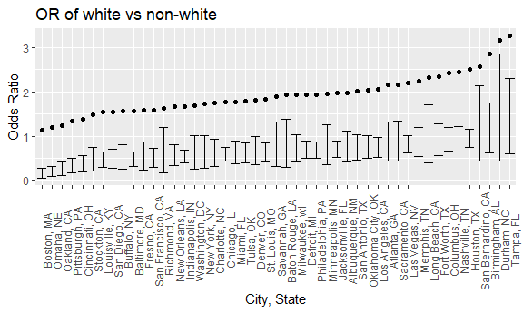

datascience homework 6
================
pc2853
November 27, 2018

Problem 1

``` r
homicide_data = 
  read.csv("data/homicide-data.csv") %>% 
  mutate(city_state = paste(city, state, sep = ", "), 
         disposition_bin = ifelse(disposition == "Closed by arrest", 1, 0),
         victim_race = factor(ifelse(victim_race != "White", "non-white", "white")),
         victim_race = fct_relevel(victim_race, "white"),
         victim_age = as.numeric(victim_age)) %>% 
  filter(!(city_state %in% c('Dallas, TX', 'Phoenix, AZ', 'Kansas City, MO', 'Tulsa, AL')))
```

regression process for the city of Baltimore, MD.

``` r
homicide_baltimore_logistic = 
  homicide_data %>%  
  filter(city_state == "Baltimore, MD") %>% 
  glm(disposition_bin ~ victim_age + victim_sex + victim_race, family = binomial(), data = .)

homicide_baltimore_logistic %>% 
  broom::tidy(exponentiate = TRUE, conf.int = TRUE) %>% 
  mutate(OR = exp(estimate)) %>%
  select(term, OR, conf.low, conf.high) %>% 
  filter(term == "victim_racenon-white") %>% 
  knitr::kable(digits = 3)
```

| term                  |     OR|  conf.low|  conf.high|
|:----------------------|------:|---------:|----------:|
| victim\_racenon-white |  1.572|     0.321|      0.636|

extracting OR for all the cities.

``` r
p1_function = function(x){
  fit_logistic = glm(disposition_bin ~ victim_age + victim_sex + victim_race, family = binomial(), data = x)
  fit_logistic %>% 
    broom::tidy(exponentiate = TRUE, conf.int = TRUE) %>% 
    mutate(OR = exp(estimate)) %>%
    select(term, OR, conf.low, conf.high) %>% 
    filter(term == "victim_racenon-white")  
}

homicide_OR = 
  homicide_data %>% 
  select(victim_age, victim_race, victim_sex, disposition_bin, city_state) %>% 
  nest(., victim_age:disposition_bin) %>% 
  mutate(models = map(data, p1_function))

homicide_OR %>% 
  select(-data) %>% 
  unnest() %>% 
  mutate(city_state = fct_reorder(city_state, OR)) %>% 
  ggplot(aes(x = city_state, y = OR)) +
  geom_point() + 
  geom_errorbar(aes(ymin = conf.low, ymax = conf.high)) +
  labs(
    title = "OR of white vs non-white",
    x = "City, State",
    y = "Odds Ratio"
  ) + 
  theme(axis.text.x = element_text(angle = 90))
```


