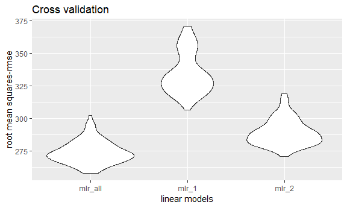

datascience homework 6
================
pc2853
November 27, 2018

### Problem 1

``` r
homicide_data = 
  read.csv("data/homicide-data.csv") %>% 
  mutate(city_state = paste(city, state, sep = ", "), 
         disposition_bin = ifelse(disposition == "Closed by arrest", 1, 0),
         victim_race = factor(ifelse(victim_race != "White", "non-white", "white")),
         victim_race = fct_relevel(victim_race, "white"),
         victim_age = as.numeric(victim_age)) %>% 
  filter(!(city_state %in% c('Dallas, TX', 'Phoenix, AZ', 'Kansas City, MO', 'Tulsa, AL')))
```

regression process for the city of Baltimore, MD.

``` r
homicide_baltimore_logistic = 
  homicide_data %>%  
  filter(city_state == "Baltimore, MD") %>% 
  glm(disposition_bin ~ victim_age + victim_sex + victim_race, family = binomial(), data = .)

homicide_baltimore_logistic %>% 
  broom::tidy(exponentiate = TRUE, conf.int = TRUE) %>% 
  mutate(OR = exp(estimate)) %>%
  select(term, OR, conf.low, conf.high) %>% 
  filter(term == "victim_racenon-white") %>% 
  knitr::kable(digits = 3)
```

| term                  |     OR|  conf.low|  conf.high|
|:----------------------|------:|---------:|----------:|
| victim\_racenon-white |  1.572|     0.321|      0.636|

extracting OR for all the cities.

``` r
p1_function = function(x){
  fit_logistic = glm(disposition_bin ~ victim_age + victim_sex + victim_race, family = binomial(), data = x)
  fit_logistic %>% 
    broom::tidy(exponentiate = TRUE, conf.int = TRUE) %>% 
    mutate(OR = exp(estimate)) %>%
    select(term, OR, conf.low, conf.high) %>% 
    filter(term == "victim_racenon-white")  
}

homicide_OR = 
  homicide_data %>% 
  select(victim_age, victim_race, victim_sex, disposition_bin, city_state) %>% 
  nest(., victim_age:disposition_bin) %>% 
  mutate(models = map(data, p1_function))

homicide_OR %>% 
  select(-data) %>% 
  unnest() %>% 
  mutate(city_state = fct_reorder(city_state, OR)) %>% 
  ggplot(aes(x = city_state, y = OR)) +
  geom_point() + 
  geom_errorbar(aes(ymin = conf.low, ymax = conf.high)) +
  labs(
    title = "OR of white vs non-white",
    x = "City, State",
    y = "Odds Ratio"
  ) + 
  theme(axis.text.x = element_text(angle = 90))
```


### Problem 2

``` r
birthweight_data = 
  read_csv('data/birthweight.csv') %>%
  mutate(babysex = as.factor(babysex), 
         frace = as.factor(frace),
         mrace = as.factor(mrace),
         malform = as.factor(malform),
         partiy = as.factor(parity))
```

I’m going to use linear regression model, as a data-driven prediction without actually knowing the underlying processes between the output and the predictors.

``` r
p2_fit = 
  lm(bwt ~ parity + fincome + babysex + mheight + ppwt + gaweeks + smoken + delwt + mrace + blength + bhead, data = birthweight_data)
p2_fit %>% 
  broom::tidy()
```

    ## # A tibble: 14 x 5
    ##    term         estimate std.error statistic   p.value
    ##    <chr>           <dbl>     <dbl>     <dbl>     <dbl>
    ##  1 (Intercept) -6099.      138.       -44.3  0.       
    ##  2 parity         96.3      40.3        2.39 1.70e-  2
    ##  3 fincome         0.318     0.175      1.82 6.88e-  2
    ##  4 babysex2       28.6       8.45       3.38 7.37e-  4
    ##  5 mheight         6.59      1.78       3.69 2.23e-  4
    ##  6 ppwt           -2.68      0.427     -6.26 4.20e- 10
    ##  7 gaweeks        11.6       1.46       7.93 2.79e- 15
    ##  8 smoken         -4.84      0.586     -8.27 1.75e- 16
    ##  9 delwt           4.11      0.392     10.5  2.26e- 25
    ## 10 mrace2       -139.        9.91     -14.0  1.21e- 43
    ## 11 mrace3        -74.9      42.3       -1.77 7.68e-  2
    ## 12 mrace4       -101.       19.3       -5.21 1.98e-  7
    ## 13 blength        74.9       2.02      37.1  4.29e-262
    ## 14 bhead         131.        3.45      37.9  3.10e-272

``` r
birthweight_data %>% 
  add_predictions(p2_fit) %>% 
  add_residuals(p2_fit) %>% 
  ggplot(aes(x = pred, y = resid)) +
  geom_point(alpha = 0.4) +
  labs(
    title = "residuals against fitted values for birthweight value",
    x = "fitted Values", 
    y = "residuals"
  )
```


Cross validation

``` r
cv_df = 
  crossv_mc(birthweight_data, n = 100) %>% 
  mutate(train = map(train, as_tibble),
         test = map(test, as_tibble))
cv_df = 
  cv_df %>% 
  mutate(mlr_all  = map(train, ~lm(bwt ~ parity + fincome + babysex + mheight + ppwt + gaweeks + smoken + delwt + mrace + blength + bhead, data = .x)),
         mlr_1 = map(train, ~lm(bwt ~ blength + gaweeks, data = .x)),
         mlr_2 = map(train, ~lm(bwt ~ bhead*blength*babysex, data = .x))
  ) %>% 
  mutate(rmse_mlr_all = map2_dbl(mlr_all,  test, ~rmse(model = .x, data = .y)),
         rmse_mlr_1 = map2_dbl(mlr_1, test, ~rmse(model = .x, data = .y)),
         rmse_mlr_2 = map2_dbl(mlr_2, test, ~rmse(model = .x, data = .y))
  )

cv_df %>% 
  select(starts_with("rmse")) %>% 
  gather(key = model, value = rmse) %>% 
  mutate(model = str_replace(model, "rmse_", ""),
         model = fct_inorder(model)) %>% 
  ggplot(aes(x = model, y = rmse)) + geom_violin() + 
  labs(
    title = "Cross validation",
    x = "linear models", 
    y = "root mean squares-rmse"
  )
```


